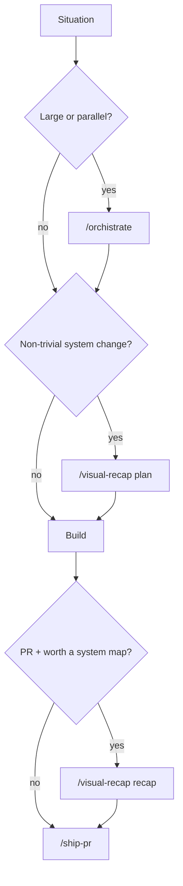

# Ask Kent

You don't remember every skill, so ask.

A **flow** is a path through the skills. Most work travels one **main flow**.
Everything else is a close call or a skip.

## How to answer

1. Place the situation on the main flow at a step.
2. Name the next `/skill` to type, and why the near-miss is wrong.
3. Say where a human decision sits (architecture, recap classification, merge).
4. **Stop.** Do not start the work. Do not invoke the skill you named.
5. If a claim about another skill matters, read that `SKILL.md` first. This map
   is a secondary source. The skill file wins.

This is a **hand-written map of this repo**. Do not scan `skills/`, do not route
over repo-local skills (Kody's `conduct`, `remix`, …), and do not route over
another author's skills. Cursor's `/orchestrate` plugin is a different skill
from `/orchistrate` here.

If they already know the skill, tell them to invoke it. `/ask-kent` has nothing
useful to add.

## The main flow: idea → ship

The route most work travels.

1. **Branch: is this large, multi-stream, or too much for one agent?**
   - **Yes** → **`/orchistrate`**. Two modes: **be** the orchestrator (plan,
     delegate, review, integrate), or **spawn** one if you are a cheap/fast
     model. Frontier model orchestrates; cheap/fast models implement. You do the
     QA — never declare done from sub-agent reports.
   - **No** → stay in this session and build it. Fan-out that does not pay is
     orchestration theater.

2. **Branch: is the change non-trivial?** System primitives, architecture,
   contracts, review-critical behavior.
   - **Yes** → **`/visual-recap` in plan mode** before you implement. Classify
     against `docs/contributing/architecture/primitives.yaml` in the _working_
     repo. Lowest-risk outcome: the plan requires **no** primitive change — say
     so.
   - **No** → skip. A tiny, obvious diff reviews faster as a plain diff.

3. **Build.** `/orchistrate` delegates this. A small change you just do.

4. **PR exists** → **`/visual-recap` in recap mode**. Reads
   `git diff <base>...HEAD`, not memory. Replaces a plan-mode block. Re-run
   after significant new commits.

5. **Babysit until it's landed** → **`/ship-pr`**. Mark ready, wait on CI
   (composes `loop-on-ci` / `fix-ci`), address valid review feedback, rebase if
   needed. Merge only if asked or the change is low risk. Always
   Discord-summarize via `kody:@kentcdodds/discord/send-shipped-pr` — never raw
   `post-message`, never guess token cost.

Keep plan → recap → ship in the repo that owns the PR. `/orchistrate` is the
parent session; implementer context is disposable.

## Situation → route

| Your situation                                 | Type this                                     | Not this                                 |
| ---------------------------------------------- | --------------------------------------------- | ---------------------------------------- |
| Idea is big, parallel, or multi-stream         | `/orchistrate`                                | Building it all yourself                 |
| You are a cheap/fast model handed a large task | `/orchistrate` (spawn a smarter orchestrator) | Doing the bulk coding                    |
| Planning a non-trivial change                  | `/visual-recap` (plan)                        | Recap mode — the work does not exist yet |
| PR needs a system-level summary                | `/visual-recap` (recap)                       | Plan mode — read the diff                |
| Tiny, obvious diff                             | skip `visual-recap`                           | A recap nobody will open                 |
| CI, review, merge, Discord summary             | `/ship-pr`                                    | Re-explaining the babysit loop           |
| Already know the skill                         | that skill                                    | `/ask-kent`                              |
| Working repo has no `primitives.yaml`          | say so; don't fake a recap                    | Inventing primitive ids                  |
| Not Kent / no Kody Discord exports             | fork `ship-pr` or skip Discord                | Pretending the Discord step will work    |

## Close calls

The useful part of this map. One concrete test each.

- **`/orchistrate` vs just build.** Can one agent finish the critical path in
  this window without file conflicts? If yes, build. Fan out only when
  independent workstreams clearly beat one implementer.
- **`/orchistrate` vs Cursor `/orchestrate`.** This repo's skill is
  **`/orchistrate`** (the extra `r`): sub-agents in one environment, model
  split, you QA. Cursor's plugin fans work across cloud agents via its own SDK.
  This map only names `/orchistrate`.
- **`visual-recap` plan vs recap.** Does the work exist? Plan describes the
  intended change. Recap describes the diff. Never recap from session memory.
- **`visual-recap` vs skip.** Would a reviewer benefit from a system map
  _before_ the diff? If no, skip. Recap is review overhead.
- **`ship-pr` vs "just merge it".** Need the CI/review loop and the Discord
  summary? That's `/ship-pr`. Merge is a branch inside it, not a different
  skill.

## Preconditions

The router names skills; it does not install them.
`npx skills add kentcdodds/kcd-skills` (or `--skill <name>`). Skills with
`disable-model-invocation: true` (`ask-kent`, `orchistrate`) still exist — type
the slash command anyway.

- **`/visual-recap`** needs `docs/contributing/architecture/primitives.yaml` in
  the working repo, plus `gh` auth to upsert the PR block.
- **`/ship-pr`** needs `gh` auth and Kent's Kody packages
  (`kody:@kentcdodds/github`, `kody:@kentcdodds/discord`). The Discord step is
  Kent-specific.
- **`/orchistrate`** needs a harness that can spawn sub-agents.

## It's working if

- It ends by naming what to type and **stops**, instead of starting the work.
- The route says where you review or verify, not just a list of skill names.
- Close skills get one concrete test for why the other is wrong.
- Any load-bearing claim about another skill shows up as a read of that
  `SKILL.md`.
- You recognize your situation, not the nearest generic scenario.
