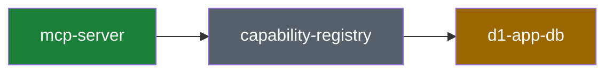

# System recap (visual plan / visual recap)

Produce a high-altitude, visual review aid directly in the PR description. No
deployment, no third-party service: GitHub renders the block (including mermaid
diagrams), and the PR itself is the storage. A future viewer app can ingest the
same marker-delimited block via the GitHub API, so follow the format exactly.

The recap is informational and non-blocking. It supplements the PR description
and normal code review; it never replaces reading the diff.

## Two modes, one format

- **Plan mode** (before/while implementing): describe the intended change
  against the current system. If no PR exists yet, put the block in the plan
  document or message; move it into the PR description once the PR exists.
- **Recap mode** (PR creation and every meaningful update): describe what the
  diff actually does. Replaces a plan-mode block if one exists.

## Source-of-truth rules (non-negotiable)

1. **Recap mode reads the diff, not memory.** Generate the recap from
   `git diff <base>...HEAD` (plus `git diff --stat`) against the PR base branch.
   Session context may explain intent, but every claim about what changed must
   be checkable against the diff.
2. **Classification is checked against the primitives map.** Read
   [`docs/contributing/architecture/primitives.yaml`](../../../docs/contributing/architecture/primitives.yaml)
   before classifying. Use its `id` values verbatim in the block.
3. **The map stays current.** If the PR adds, removes, or materially reshapes a
   primitive, update `primitives.yaml` in the same PR and say so in the block.

## Risk classification

Classify each touched primitive, then roll up to the highest severity as the
overall classification (`adds` > `extends` > `composes`):

| Classification | Meaning                                                    | Risk   |
| -------------- | ---------------------------------------------------------- | ------ |
| `composes`     | Uses existing primitives as-is; wiring and call sites only | Low    |
| `extends`      | Changes a primitive's behavior, shape, or contract         | Medium |
| `adds`         | Introduces a new primitive (must update primitives.yaml)   | High   |

A change touching invariants from `primitives.yaml` (for example per-user
isolation) is called out explicitly regardless of classification.

## Block format

The block lives in the PR description between HTML comment markers, wrapped in
`<details>`. Fixed section order — a future ingestion process parses this
structure. Omit optional sections rather than leaving them empty.

````markdown
<!-- system-recap:start -->

<details>
<summary>System recap — <b>composes existing primitives</b> (low risk)</summary>

**Mode:** recap · **Base:** `main` @ `abc1234` · **Head:** `def5678`

**Classification:** composes — no primitives added or changed; this PR wires
existing primitives together.

### Primitives touched

| Primitive    | Group    | Impact                                  |
| ------------ | -------- | --------------------------------------- |
| `mcp-server` | surfaces | composes                                |
| `d1-app-db`  | storage  | extends — new `jobs.retry_count` column |

### System map



### Change flow

_Optional: a mermaid flowchart or sequence diagram of the specific change._

### Before / after

_Optional: schema, API shape, or route changes as compact before/after fenced
blocks or tables._

### Invariants

_Optional: only when the change touches an invariant from primitives.yaml._

### Plan vs actual

_Recap mode only, when a plan-mode block existed: what shipped as planned and
what drifted, in a short list._

</details>

<!-- system-recap:end -->
````

Format rules:

- The `<summary>` line always carries the overall classification and risk in
  bold so reviewers see it without expanding.
- Blank line after `<summary>` and around every fenced block, or GitHub will not
  render the markdown/mermaid inside `<details>`.
- **System map**: show touched primitives plus their immediate neighbors from
  the map — not all ~25 nodes. Color with the four `classDef` styles above
  (`touched` = composes, `extended`, `added`, `untouched` for context nodes).
  Quote node labels containing spaces or special characters.
- Keep the whole block scannable: prefer tables and diagrams over prose, and
  keep it well under ~120 lines.

## Workflow

### Recap mode (PR create/update)

1. Read `docs/contributing/architecture/primitives.yaml`.
2. Get the facts: `gh pr view <n> --json baseRefName,headRefName`, then
   `git diff <base>...HEAD --stat` and the full diff for anything you did not
   author this session.
3. Map changed paths to primitives via the map's `code` entries; classify each;
   roll up the overall classification.
4. Author the block following the format above.
5. Upsert it into the PR description:

   ```bash
   node .agents/skills/visual-recap/scripts/upsert-recap-block.mjs <pr-number> <block-file>
   ```

   The script replaces the content between the markers, or appends the block to
   the end of the description on first run. It never touches text outside the
   markers.

6. Re-run steps 2-5 after pushing significant new commits to the PR.

### Plan mode

Same steps, except: `**Mode:** plan`, no Base/Head commits required, "Primitives
touched" describes intended impact, and add a one-line note when the plan
requires **no** change to any primitive — that is the lowest-risk outcome and
worth stating explicitly. When implementation later diverges from the plan, the
recap's "Plan vs actual" section records the drift.
